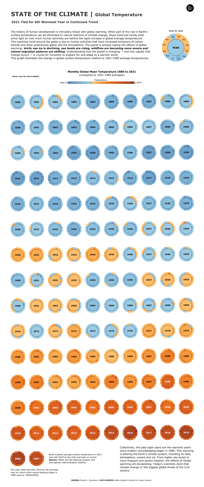
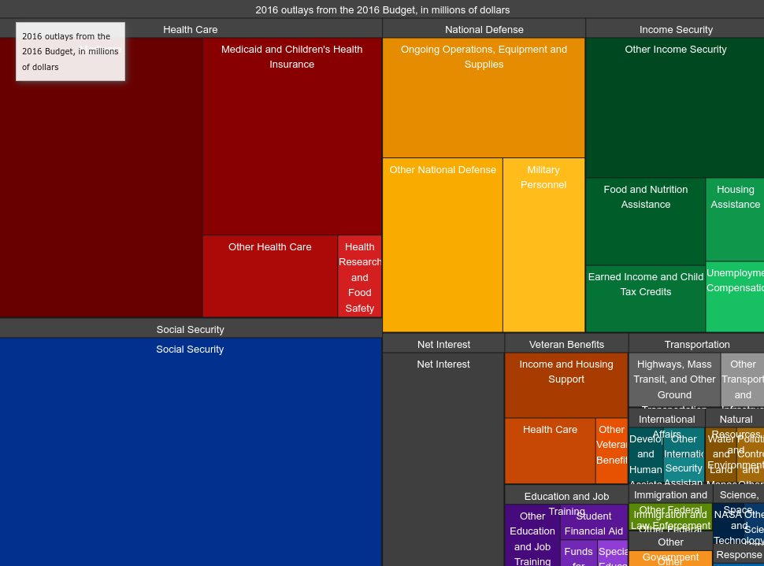

### What makes a good data visualisation?

We're looking at **4** levels of visualisation validation here: *domain/problem* → *data/task abstraction* → *visualisation idiom* → *algorithm/technology*.
* *Domain/problem*
	* Is a particular visualisation approach even necessary or feasible for the problem at hand?
	* Is the data available in the first place? Is it machine-readable? How easy will it be to clean/parse?
* *Task abstraction* \(c.f. [Matthew Brehmer](https://mattbrehmer.ca/proj/visdc-slides.pdf)\)
	* Why do you want to visualise this data?
	* How is the task supported in terms of the visual lexicon of the chart/product?
	* How is the task supported in terms of interaction? How is the task supported in terms of what the user is allowed to view?
	* What are the inputs and outputs of the task, and what is the task sequence here?
* *Visualisation idiom*: [more to come later]
* *Algorithm/technology*
	* Is the technology stack here effective? Do the tools in use let the visualisation run smoothly, or is this a case of 'everything looks like a nail'?
	* Can the structure of front-end/back-end technologies deliver the visualisation efficiently? (e.g. caching the necessary small chunks of data instead of everything at once)

Together, we have a vocabulary to evaluate effective data visualisations across different domains. All data visualisations abstract the process of crunching numbers into a series of mental or visual tasks for the user, via the use of one or more visual idioms. Domain/problem and algorithm/technology problems, however, tend to be more implementation-specific; I personally feel it's a little unfair to critique them given that we're commenting on finished products from afar.

Here's the framework as applied to two interactive visualisations I found.

#### 1a. [State of the Climate (donut version)](https://public.tableau.com/app/profile/preethilo/viz/STATEOFTHECLIMATEGlobalTemperature/STATEOFTHECLIMATEDonut?publish=yes) by Preethi Lodha

##### Tableau, 2022

This was posted on [r/dataisbeautiful](https://www.reddit.com/r/dataisbeautiful/comments/sa25cp/oc_state_of_climate_global_temperatures_a_tale_of/) as an exercise in evaluating effectiveness between two visualisations of the same data. As a chart of global temperatures, two tasks are immediately apparent. I want to learn how global temperatures have changed over time, and if there are any patterns I can see given the month-level granularity in the data. Specifically, it would be helpful to view the magnitude and pace of the change, while also having a way to observe finer variations in the data.

What are the differences? In the donut version, you can scroll down the page to watch global temperatures rise to the level of 1951-1980 averages, then supersede them drastically in the last decade. Mousing over each donut's slices allows you to read the temperature for each month in the year. The colours are simple: 5 shades of blue for temperatures cooler than the 1951-1980 average, and 9 shades of red for temperatures hotter than that. The design choice to starkly delineate 'hotter' and 'cooler' temperatures is, charitably speaking, effective in communicating a sense of emergency about rising global temperatures. Humans are bad at reading small numbers (fractions of degrees Celcius per month is hardly imaginable) and I think the drastic colour scheme helps in making that difference clear. However, I think the nuances of the data could be better communicated without resorting to exaggeration.

(It's also not clear how many fractions of a degree Celcius is represented by a change in colour; the scale isn't labelled well enough.)

*Solutions*
* Adding a notched scale with a marked zero, as well as choosing round decimal values for the minimum and maximum points, could better link the viewer's perception of colour changes alongside what they're learning about the world's temperature.
* Use a more gentle gradient for the colours so that 'slightly hot' and 'slightly cold' look more similar.

Sequentially, there is a clear taskflow presented by the donut chart by the sheer height of the data; you're forced to scroll down to see it all, allowing the temperature rise to become apparent along the passage of time. However, it runs the risk of becoming too cluttered, as the circles look too similar and the rhythm becomes monotonous.

*Solutions*
* Consider a more compact chart?

#### 1a. [State of the Climate (unit version)](https://public.tableau.com/app/profile/preethilo/viz/STATEOFTHECLIMATEGlobalTemperature/STATEOFTHECLIMATEDonut?publish=yes) by Preethi Lodha

*(click on the 'unit' icon in the top-right-hand corner of the viz)*

##### Tableau, 2022

So is the unit chart better? Immediately, we're able to ascertain that this chart is more compact than the first one. The intended reading direction is now from left-to-right; our eyes are drawn from the sections of lighter blue on the middle and left, towards the sections of dark red on the far right. Months are now represented as 12 slices of each vertical bar; by reading downwards, you can immediately identify which months tend to be slightly hotter than the other (March-ish, and maybe October). We couldn't make this comparison in the donut chart, because we couldn't see all the years together like this at once, unless we scrolled up and down a lot and Rain-Manned the heck out of the donut slices. This is an important lesson for task abstraction design----patterns should be discernable with as little input by the user as possible. Our eyes scan a lot faster than our fingers.

The taskflow----a linear journey through time with opportunities to mouseover and explore specific moments----remains largely the same. It does become a bit harder to draw attention to individual months or years the way the donut chart does, simply because every year is squashed together so densely. This is not really an issue when the main story at hand is the drastic rise in temperatures over the last four decades, but it could be detrimental if the chartmaker wanted to highlight particular years, like the anomalously-warm 1998. 

Overall, I think the unit chart is more effective here. It 'feels right', to be sure, but having a lexicon for visualisation validation lets us talk about *how*. However, it still doesn't solve the issue of the exaggerated colour scale, or help us understand just how bad a 1.46°C rise in world temperatures can be. At worst, visualisations like these can be fuel for climate change denialists to 'prove' that the mainstream media is prone to catastrophising minor temperature fluctuations. A better visualisation should be able to communicate the scale of climate change and the danger it poses without using visual idioms that can be construed as misleading.

#### 2. [President Barack Obama's Proposed Tax Budget](https://obamawhitehouse.archives.gov/interactive-budget) by the White House's Office of Management and Budget

##### Canvas, 2016

I'm a lot less charitable about this one given that it's a professional illustration for a presidential campaign. The task we have here is simple: comparing how much Obama's administration planned to spend on certain priorities over others in 2016.

It's presented as a treemap, which makes sense for presenting the hierarchical nature of a national budget. Spending is classed into program areas, then classed into specific outlays for that area. Bigger rectangles mean more spending. Program areas share the same colour, with each outlay in a different hue, which makes the categories immediately distinct. Clicking each rectangle lets a specific outlay or category or outlay fill the screen, which lets the smaller categories be read. Upon filling the screen, the text changes to display Obama's campaign priorities regarding that budget outlay, plus a link to further information elsewhere.

The first flaw that pops out is that the font size for the visualisation is static. The smaller budget categories are completely unreadable as a result.

The bigger problem, though, is the difficulty in communicating data through area. Humans can estimate lengths and widths more precisely than areas; it's hard to tell, for example, how much more was spent on national defense than income security. In the treemap's defense, it can be argued that the format remains effective for communicating order-of-magnitude differences. However, considering that this visualisation was designed as interactive in mind, there are definitely ways to allow better granularity.

*Solutions*
* Categories could have an option to be hidden/unhidden or rearranged alongside each other.
* A sortable bar chart could help visualise the relative importance between categories. This also allows smaller categories to be more easily discovered.

The second issue I have with this is the prominence of the numbers. It takes a while to realise where the spending for each category can be found. You have the mouseover the drab grey headers for each category----a kind of design trap, as the headers can't be more prominent without messing up the visual hierarchy from general to specific, but their lack of prominence makes finding out crucial info about their exact figures unintuitive. Again, any patterns in the data should be easily-discoverable with a minimum of user input.

*Solutions*
* Putting the spending numbers on each rectangle (or on a caption pointing to each rectangle) would make these patterns more visible, helping the reader understand just how much money is in play.
* The design trap of the drab grey headers could be overcome by printing each general spending category (health care, national defense, etc.) on each big rectangle/caption first, then having the rectangle decompose into specific outlays upon clicking through. 

Formatting the spending numbers in human-readable amounts would also help in parsing the data----e.g. printing "$589.7 billion USD" instead of "$589,720" and a table header stating the unit of measurement. I'll admit it took more time than necessary for me to figure out that the amount of spending at play here was on the order of magnitude of billions. Don't just blindly pull data from a backend----try to parse it for your reader first.

Overall, for a professional application this needs a bit of work.

### Conclusion

Using a visualisation validation framework allows us to clarify what 'feels' wrong and easily act upon it. While some of these criteria appear subjective at first glance, breaking down a visualisation into its basic tasks allows us to judge them on their own terms, turning bad design from an entertaining spectacle to a solvable problem instead.

#### Key takeaways:
* Patterns should be discernable with minimal user interaction.
* Use animation to your advantage.
* Check if your idiom fits the format and task. Does the type of chart hide certain important data? Does the type of chart fit your reader's viewing format?

I hope this has been as helpful for you as it was for me. :)
